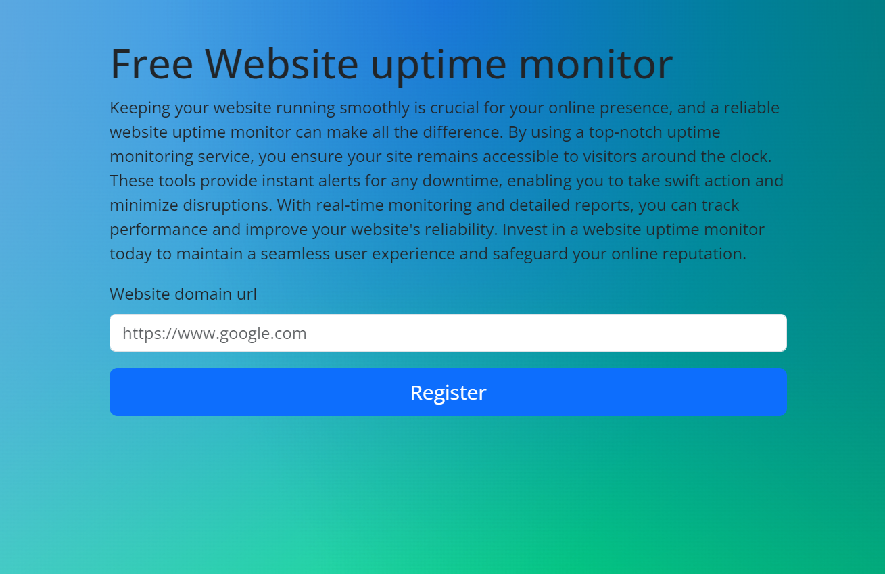
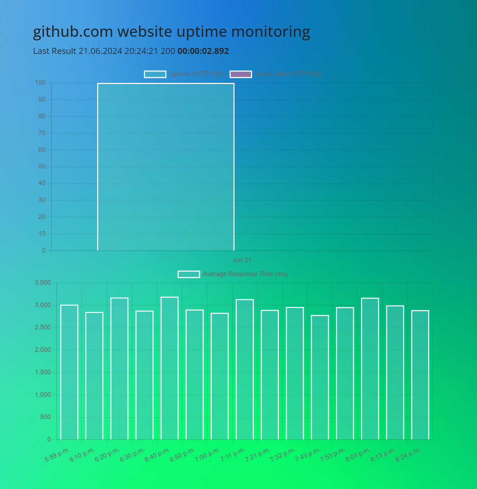
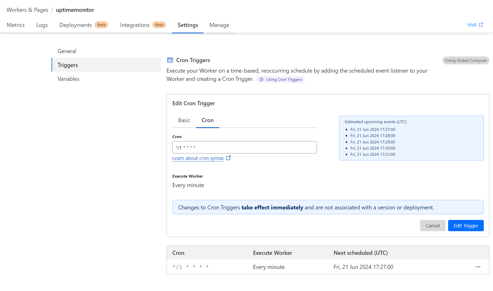

# website uptime monitor

## info
Create a database, set the db configs in the wrangler.toml file, 
change the `workerUrl` variable in src/index.js to suit your needs. 
Adjust the cron settings from settings/trigger/cron triggers and that's it.

## todo

- [ ] delete old records
- [ ] delete websites
- [ ] Remove the 50 website limit